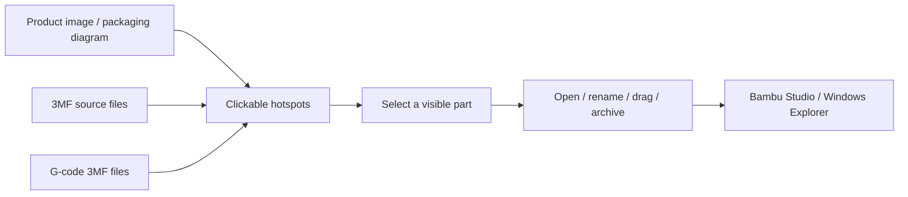

# PartMap — Visual 3MF & G-code Organizer for Bambu Studio

<p align="center">
  
</p>

<p align="center">
  <strong>Find the right print file visually instead of digging through folders.</strong>
</p>

<p align="center">
  <a href="https://github.com/hellysu/partmap-oss/releases/latest"><strong>Download for Windows</strong></a>
  ·
  <a href="#quick-start">Quick Start</a>
  ·
  <a href="#中文说明">中文说明</a>
</p>

<p align="center">
  <a href="https://github.com/hellysu/partmap-oss/releases/latest"></a>
  <a href="https://github.com/hellysu/partmap-oss/actions/workflows/pr.yml"></a>
  <a href="LICENSE"></a>
  
  
</p>

PartMap is an open-source Windows desktop app for visually organizing `.3mf` and `.gcode.3mf` files around product diagrams.

Instead of searching through folders and long filenames, you can click the part on a product image and immediately see the model and sliced files that belong to it.

It is built for real 3D-printing workflows where one product contains many printable parts, multiple versions, and multiple G-code outputs — especially when files are shared between Windows PCs and used with Bambu Studio.

## Why PartMap?

A typical 3D-printing product may contain a helmet, sword, base, accessories, multiple revisions, and several sliced outputs. Traditional folder structures become slow and error-prone once the number of files grows.

PartMap turns a packaging image, exploded view, or product diagram into a visual file index:

- click a part on the image → see its files
- drag files onto a hotspot → bind them to that part
- keep original `.3mf` and `.gcode.3mf` outputs separated
- rename, open, archive, or drag files without leaving the app
- move the whole project to another computer without a database or cloud service

## How It Works



PartMap keeps the visual part map and the real files connected, while the files themselves stay in normal Windows folders.

## Download

**Latest release:**  
https://github.com/hellysu/partmap-oss/releases/latest

Recommended packages:

- **`PartMap-Setup-win-x64-*.exe`** — recommended for most Windows users
- **`PartMap-Portable-win-x64-*.zip`** — portable 64-bit version
- **`PartMap-Portable-win-x86-*.zip`** — 32-bit compatibility build
- **`SHA256SUMS.txt`** — release checksums

All release packages are self-contained .NET 8 builds. You do **not** need to install .NET separately.

> The installer is currently not code-signed, so Windows SmartScreen may show an unknown-publisher warning.

## Key Features

### Visual hotspot mapping
Turn a product image into a clickable parts map. Each hotspot can be linked to one or more file groups.

### 3MF + G-code 3MF organization
PartMap distinguishes source `.3mf` files from sliced `.gcode.3mf` files so operators can quickly choose the correct file type.

### Drag-and-drop workflow
Drag files into PartMap, between hotspots, back to the unclassified area, or out to Windows Explorer and slicing software.

### Portable product metadata
Each product can keep portable configuration in its model folder, including:

- product name
- hotspot coordinates
- file grouping
- manual mapping rules
- product/packaging image

### Shared multi-computer use
PartMap supports shared-folder workflows with file locking and version protection to reduce accidental configuration overwrites.

### File history
Move old files into a dedicated history folder with automatic date/version naming while keeping the active workspace clean.

### Bambu Studio workflow
PartMap can be used alongside Bambu Studio and includes optional slicing-related integration for supported workflows.

## Quick Start

1. Run `PartMap.exe` or install the latest Windows release.
2. Click **New Product**.
3. Choose a product/packaging image and the folder containing your model files.
4. Open **Layout Edit** mode.
5. Draw a hotspot over a part and give it a name.
6. Drag detected file groups onto that hotspot.
7. Exit layout editing and click parts on the image to browse their files.

If the current product still contains unclassified files, PartMap can automatically enter layout editing mode when that product is opened.

## Typical Workflow

1. Keep the product's model files in one folder.
2. Add the product to PartMap.
3. Use a packaging image, exploded view, or reference diagram.
4. Bind visible parts to their matching `.3mf` and `.gcode.3mf` files.
5. Click a part whenever you need to open, rename, drag, archive, or slice the correct file.

This is particularly useful for production environments where operators need to locate the right file quickly and avoid selecting the wrong revision.

## File Operations

- **Double-click / Enter** — open a 3MF file using the Windows default application
- **Drag `.3mf` files in** — copy them into the current product model directory
- **F2** — rename the real file
- **Delete / Delete File** — move local files to the Windows Recycle Bin
- **Drag file cards out** — send files to the desktop, Explorer, or slicing software
- **Show in folder** — reveal the real file in Explorer
- **Change directory** — rebind a product to another model directory without copying files

Windows duplicate names such as `.gcode(1).3mf` and `.gcode(2).3mf` are also recognized as G-code 3MF files.

## Portable Project Data

PartMap can maintain portable project metadata inside the model directory:

```text
配置/
├─ PartMap.product.json
└─ 包装图.*
```

This portable data can travel with the product folder to another computer.

To migrate a product:

1. Open and save the product once with a recent PartMap version.
2. Confirm the `配置` folder exists inside the model directory.
3. Copy the complete model directory to the other computer.
4. Open PartMap and choose **Import Folder**.
5. Select the model directory containing `配置/PartMap.product.json`.

PartMap restores the product, image, hotspots, and mappings, then updates the model path for the new computer.

PartMap does not duplicate the original model files just to create portable metadata.

## Shared Folder / Multi-PC Notes

For multi-computer use:

- use the same PartMap version on each computer
- ensure every computer has read/write access to the program and model folders
- use UNC paths such as `\\server\share\models` when possible
- product configuration uses locking and version checks
- simultaneous conflicting edits are not silently overwritten
- renaming and deleting changes the real files in the shared directory

Network shares often do not use the local Windows Recycle Bin. Use NAS/server recycle-bin, snapshots, or backups when appropriate.

## Filters and File Grouping

The display filter can switch between:

- all 3MF files
- only `.gcode.3mf`
- only ordinary `.3mf`

Filtering changes only what is displayed. It does not delete files or remove mappings.

A hotspot may contain multiple file groups. Groups can also be removed from one hotspot without affecting references from other hotspots.

## File History

The **Move to History** action moves selected real files into the product's `历史` directory.

Archived filenames include the current date, for example:

```text
头盔_2026-09-23.3mf
头盔_2026-09-23_v1.3mf
```

G-code filenames keep their special suffix in the correct position.

## 中文说明

PartMap 是一个 Windows 开源桌面工具，把产品示意图变成可操作的 3MF / G-code 3MF 文件索引。

它主要解决的是：**一个产品零件很多、文件版本很多、切片文件很多时，不再靠翻文件夹和猜文件名找模型。**

你可以直接点击图片上的部件，然后在右侧看到这个部件对应的普通 3MF 与 G-code 3MF 文件。

主要能力：

- 产品图片热点与文件绑定
- 普通 3MF / G-code 3MF 分开管理
- 文件拖入、拖出、改名、打开、归档
- 未归类文件集中处理
- 整个产品目录可以迁移到另一台电脑
- 产品配置跟随模型目录保存
- 支持多台电脑共享同一套模型目录
- 可配合 Bambu Studio 工作流使用
- 不依赖数据库或云端服务

### 基本使用

1. 双击 `PartMap.exe`。
2. 点击“新建产品”，输入产品名，并选择包装图和原模型目录。
3. 打开“布局编辑”。
4. 在图片对应部位框选热点并命名。
5. 把左侧待归类文件组拖到对应热点。
6. 关闭布局编辑。
7. 日常使用时点击图片上的部件，即可查看右侧对应文件。

从资源管理器把 `.3mf` 拖到图片热点，会复制到当前模型目录并直接绑定该部件。拖到右侧部件文件区域，会加入当前选中的部件。

### 子目录与排除目录

底部“读取子目录”默认关闭，因此默认只读取模型根目录。

需要时可以单独为某个产品开启子目录扫描，并使用“排除文件夹…”忽略不需要扫描的子目录。

排除设置按相对路径保存在产品配置中。

### 两台电脑同时使用

- 两台电脑建议运行相同版本
- 两边都需要模型目录的读写权限
- 推荐使用统一 UNC 路径
- 热点与映射会跟随共享配置同步
- 同时修改同一产品时使用锁与版本检查避免静默覆盖
- 真实文件的重命名和删除会立即作用于共享目录

## Build from Source

Requires .NET 8 SDK or newer:

```powershell
dotnet build PartMap.csproj -c Release
dotnet run --project tests/PartMap.SmokeTests/PartMap.SmokeTests.csproj -c Release
dotnet publish PartMap.csproj -c Release -r win-x64 --self-contained true -p:PublishSingleFile=false
```

## Development

- [DEVELOPMENT.md](DEVELOPMENT.md)
- [CONTRIBUTING.md](CONTRIBUTING.md)
- [SECURITY.md](SECURITY.md)
- [CODE_OF_CONDUCT.md](CODE_OF_CONDUCT.md)

## License

PartMap is released under the [MIT License](LICENSE).
